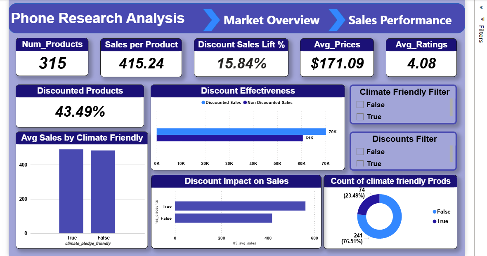
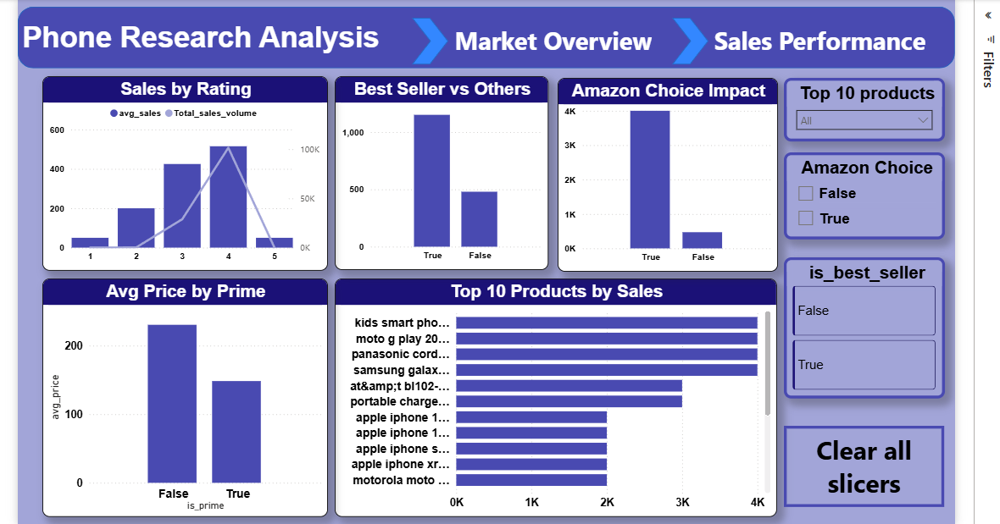

#  Smartphone Sales & Market Research Analysis

##  Project Overview
An end-to-end data analytics project focused on smartphone market research and sales analysis using Python and Power BI.

The project combines:
- Data cleaning
- Exploratory Data Analysis (EDA)
- Sales analytics
- Interactive dashboard reporting

to generate insights about:
- Product performance
- Pricing strategies
- Discounts impact
- Customer ratings
- Best seller behavior
- Prime and Amazon Choice influence

---

#  Business Objectives
- Analyze smartphone sales performance
- Evaluate discount effectiveness
- Understand customer rating impact on sales
- Identify top-performing products
- Compare Prime vs non-Prime product pricing
- Analyze climate-friendly product behavior

---

#  Tools Used
- Python
- Pandas
- NumPy
- Power BI
- Data Visualization

---

#  Project Workflow

## Data Collection
Imported raw smartphone product and sales dataset.

---

## Data Cleaning Using Python
Performed extensive cleaning and preprocessing including:
- Handling missing values
- Removing duplicates
- Fixing inconsistent formatting
- Data type corrections
- Feature preparation

---

## Exploratory Data Analysis (EDA)
Performed exploratory analysis to identify:
- Sales distribution
- Rating patterns
- Discount effectiveness
- Product category trends
- Prime and Amazon Choice behavior

---

## Dashboard Development
Built interactive Power BI dashboards for:
- Market overview
- Sales performance
- Product comparison
- Discount analysis
- Customer rating insights

---

#  Key KPIs
- Number of Products
- Sales per Product
- Discount Sales Lift %
- Average Prices
- Average Ratings
- Discounted Products %
- Top Products by Sales

---

# Dashboard Pages

##  Market Overview
Provides insights into:
- Product pricing
- Discount effectiveness
- Climate-friendly products
- Sales lift analysis
- Product distribution

---

##  Sales Performance
Focused on:
- Sales by rating
- Best seller analysis
- Amazon Choice impact
- Prime product comparison
- Top-performing products

---

#  Key Insights
- Discounted products generated higher average sales.
- Best seller products significantly outperformed other products.
- Higher-rated products achieved stronger sales performance.
- Amazon Choice products showed higher sales volume.
- Prime products demonstrated different pricing behavior.

---

#  Recommendations
- Increase focus on highly rated products.
- Optimize discount strategies for weaker-performing products.
- Improve visibility of high-performing Prime products.
- Monitor pricing strategies across product categories.
- Expand climate-friendly product offerings.

---

#  Dashboard Preview

## Market Overview

---

## Sales Performance

---

#  Project Files
- Raw dataset
- Cleaned dataset
- Python notebook (.ipynb)
- Power BI dashboard (.pbix)
- Dashboard screenshots

---

#  Author
Ahmed Mohamed  
Pharmacist & Data Analyst | Power BI | SQL | Python | Healthcare Analytics

LinkedIn:
https://www.linkedin.com/in/ahmed-mohamed-data-analysis

GitHub:
https://github.com/ahmedmoham4d2003-dotcom
